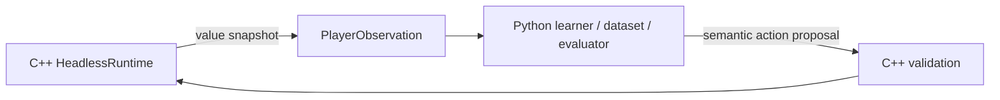

# Python Learning Bridge Design

## Goal

Define a safe, measurable boundary for Python learning and evaluation code to consume the authoritative C++ headless runtime. This document sets the contract and comparison method; it does not select a transport before measurements exist.

## Ownership and data flow

- C++ Core/Runtime owns canonical game state and all state transitions.
- Python receives a copied player-visible observation and returns a semantic proposal. It never writes game state.
- The C++ Runtime validates and applies proposals through the same command path used by other players.
- The bridge must not reveal hidden rows, unpublished future pieces, bag contents, or internal RNG state. The canonical field contract is `docs/cpp-visible-observation.md`.
- Learning bridge APIs are distinct from the external `AIBackend` transport described in `docs/ai-runtime-backend.md`; do not make native gameplay depend on Python.
- Fixed seed, configuration, and input sequence must produce repeatable observation/action traces. Parallel workers each own an independent runtime.

## Transport candidates

Keep the C++ native baseline direct. Compare bridge candidates with the same workload before choosing one.

| Candidate | Strength | Cost or risk |
| --- | --- | --- |
| C++ native baseline | No bridge overhead; reference throughput | Does not execute a Python learner |
| In-process CPython extension | Low per-call transport overhead | Python embedding/extension ABI and distribution complexity |
| Persistent JSONL process | Simple isolation and existing project experience; amortizes startup | Serialization and pipe-copy overhead |
| Shared memory | Potentially low copy cost for large batches | Synchronization, lifecycle, and debugging complexity |

Do not spawn a process per decision. For persistent workers, use one process per independent runtime/worker. Batch calls only when doing so preserves the same tick and command semantics.

## Benchmark protocol

Compare candidates using the same Release C++ build, fixed seed set, game configuration, and deterministic policy/input workload. Record the source revision and machine/build configuration with results.

Measure startup separately from steady state. Report tick advancement alone, observation creation alone, and observation-plus-proposal round trip separately. Run both single-worker and multi-worker cases; warm up, repeat each case, and report median throughput (ticks/s, observations/s, decisions/s, and games/s) plus a deterministic trace checksum. Candidate traces must match the native reference where semantics are intended to match.

Keep native gameplay cost separate from bridge cost. Do not impose an arbitrary speed threshold; choose the simplest candidate that satisfies measured throughput, worker scaling, Windows distribution, and CI needs. Reconsider shared memory only if measurements show serialization/copying is the limiting cost.

## Implementation sequence

1. Lock observation visibility and proposal validation with focused C++ tests.
2. Add a bounded, reproducible benchmark harness for the native baseline and viable transport candidates.
3. Select a transport from measured throughput, complexity, Windows distribution, and CI evidence.
4. Implement the narrow bridge and verify fixed-seed trace parity, invalid-proposal rejection, independent worker state, and distribution smoke behavior.

The C++ Runtime remains buildable and testable without Python. Python remains responsible for learning, dataset generation, evaluation, and experiments.
