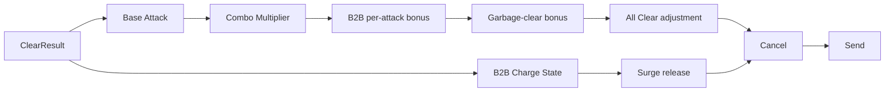

# TETR.IO準拠ルール

更新日: 2026-09-10

## 目的

本プロジェクトの対戦テトリス実装・AI評価環境が、TETR.IOの標準的な対戦ルールとどこまで一致しているかを明示し、実装時の基準を固定する。

TETR.IOは継続的に更新されるため、この文書では「TETR.IOの標準対戦ルール、特にTetra League Season 2系の現行仕様」を基準とする。Quick Play固有の高度・疲労・ターゲット補正等は別ルールセットとして扱い、標準1v1へ混ぜない。

## 参照元

一次情報を優先する。

- TETR.IO Patch Notes: https://tetr.io/about/patchnotes/
- TETR.IO: https://tetr.io/
- 補助資料: TetrisWiki TETR.IO: https://tetris.wiki/TETR.IO

重要な仕様変更:

- 2024-08-16 Beta 1.2.0: Tetra League Season 2開始。B2B Charging / Surge、opening時の2倍cancel、All Clear 5 garbage等。
- 2024-09-22 Beta 1.3.0: garbageを消したQuad/Spinへ固定+1 garbage。
- 2025-01-18 Beta 1.5.0: All-Mini+系Spin判定、Clutch Clear再導入。
- 2025-01-25 Beta 1.5.1: T-Spins+等の追加。標準ルールとカスタムルールを混同しない。

## 準拠対象

### 1. 盤面とミノ

| 項目 | TETR.IO準拠目標 | 現状 |
| --- | --- | --- |
| 盤面幅 | 10列 | 対応済み |
| 可視高さ | 20行 | 対応済み |
| hidden rows | 内部表現として十分な余裕を持つ | 2行のみ。要再検討 |
| ミノ | I/O/T/S/Z/J/L | 対応済み |
| Randomizer | 7-bag | 対応済み |
| Hold | 1 piece、1 placementにつき1回 | 基本対応済み |
| NEXT | 複数pieceを観測可能にする | 未実装 |

hidden rowsは描画上の20行とは独立させる。回転kick、spawn、clutch clear、lock outを正確に扱える内部高さを確保する。

### 2. Spawn / Hold

- 各pieceはTETR.IO/SRS+のspawn orientationとspawn位置を使う。
- Hold交換時も通常spawnと同じ規則を適用する。
- IHS/IRSを将来扱えるよう、spawn直前入力を表現可能な状態遷移にする。
- Holdで即死する場合を含め、block out / lock out / clutch clearを明確に分離する。

現状は全pieceを単純に4x4左上原点へ正規化しており、SRS系の回転中心と一致しない。

### 3. Rotation

標準回転はSRS+を基準とする。

必要機能:

- clockwise 90°
- counter-clockwise 90°
- 180° rotation
- JLSTZ用kick table
- I用SRS+ kick table
- Oの規定回転挙動
- 180°専用kick table
- 回転成功時に使用したkick indexを記録

実装上は「shapeを回して左上へ正規化」してはならない。pieceごとの固定回転状態と回転中心を保持する。

### 4. Gravity / Lock

TETR.IOは入力・gravity・lock delayを時間ベースで扱うため、本プロジェクトでも整数tickで再現できる形にする。

最低限分離する値:

- gravity
- soft drop factor
- lock delay
- lock reset条件
- lock reset回数またはstall制約
- ARE / line clear timing（対戦再現性が必要になった段階）

AIの盤面探索だけを行うモードでは時間処理を省略可能だが、「TETR.IO互換ruleset」と名乗る実戦シミュレータでは省略しない。

### 5. Spin判定

標準対戦は現行仕様に合わせてAll-Mini+を基準候補とする。

最低限、clear結果を次のような構造で表現する。

```text
ClearResult
- lines
- spin_type: none / mini / full
- piece
- difficult_clear
- all_clear
- cleared_garbage
- combo
- b2b_count
- used_kick
```

Spinは単なる「T pieceだったか」ではなく、最終操作、immobility、Tの判定規則、kick履歴等を使って判定する。

### 6. 基礎attack

現行の単純line clear基礎値だけでは不十分。

通常clearの基礎は概ね以下を起点とする。

| Clear | Base attack |
| --- | ---: |
| Single | 0 |
| Double | 1 |
| Triple | 2 |
| Quad | 4 |

これにSpin、Mini、All Clear、combo multiplier、B2B Charging、garbage-clear bonus等が加わる。

攻撃計算は1個の`attack_for_clear(lines, combo, back_to_back)`へ詰め込まず、以下の順に分ける。



### 7. Combo

TETR.IO標準対戦ではMultiplier comboを使う。

基本式は、base attackが正なら概ね

```text
base * (1 + 0.25 * combo)
```

を使い、標準的な対戦ではDOWN（切り捨て）roundingを基準にする。

base=0時のcombo処理も別式を持つため、現在の`max(0, combo - 1)`による単純加算はTETR.IO互換ではない。

### 8. Back-to-Back Charging / Surge

Season 2系標準対戦では旧B2B chainingではなくB2B Chargingを使う。

- difficult clearごとの通常attackへ+1
- B2B x4でSurgeをcharge開始
- 標準対戦では開始時Surge=4
- 以降B2Bが伸びるごとにSurgeも増える
- B2Bを通常Single/Double/Triple等でbreakするとSurgeを解放
- Surgeは3分割attackとして送信される

従ってB2Bは`bool`ではなく、少なくとも以下を保持する。

```text
B2BState
- count
- surge_charge
- active
```

### 9. All Clear

Season 2標準対戦ではAll Clearは5 garbageを送り、B2Bにも関与する。

単なる4-line clearと同じ処理にしてはならない。

### 10. Garbage clear bonus

Beta 1.3.0以降、garbageを含む行をQuadまたはSpinで消した場合、倍率の影響を受けない固定+1 garbageが加わる。

そのためBoardは「occupied bool」だけでは足りず、少なくとも通常blockとgarbage blockを区別可能にする必要がある。

### 11. Garbage / Cancel

対戦再現ではgarbageを単なる整数残量として扱わない。

必要な概念:

- pending garbage queue
- attack packet
- hole column
- change-on-attack系messiness
- travel delay
- garbage cap / insertion timing
- garbage blocking / cancelling
- opening 14 piecesの特殊cancel

Season 2標準対戦では、最初の14 piecesについて、pending garbageが自分のsent garbageより多い条件でcancel効率が2倍になる。

`cancel_attack(incoming: int, outgoing: int)`だけではpacket順序、delay、hole情報、Surge分割を表現できない。

### 12. Top-out / Clutch Clear

現行TETR.IOではClutch Clearが再導入されている。

- block out
- lock out
- line clearによる救済
- 次pieceを押し上げるClutch Clear

を個別にテストする。

`spawnできなければ即game_over`だけではTETR.IO挙動と一致しない場合がある。

## 現行実装の準拠評価

### 対応済みまたは方向性が正しい

- 10x20を基本とするBoard
- 7種tetromino
- 7-bag randomizer
- seedを渡せる決定論的randomizer
- Holdの1-placement 1回制限
- core / application / AI / adapter分離
- GUI非依存core
- integer tickを採用する設計方針

### 部分対応

- hidden rows: 2行では将来のSRS+/Clutch Clearには不足する可能性が高い
- Hold: 基本機能はあるがspawn/IHS/IRS/top-out規則が未対応
- attack: Single/Double/Triple/Quadの基礎値のみ概ね一致
- cancel: 数量相殺だけ存在するがqueue/packet/タイミングがない

### 非準拠 / 未実装

- SRS+
- 180 kick
- SRS回転中心
- exact spawn state
- NEXT queue
- gravity / lock delay / lock reset
- Spin / Mini / All-Mini+
- Multiplier combo
- B2B Charging
- Surge
- All Clear attack
- garbage-clear +1 bonus
- garbage block識別
- garbage queue / hole / messiness / delay
- opening 14-piece double cancel
- Clutch Clear
- TETR.IO相当top-out判定

## 設計提案

### Rulesetを独立させる

TETR.IO固有仕様を`GameState`へ直書きしない。

例:

```text
src/tetris/rules/
    ruleset.py
    tetrio_standard.py
    rotation_srs_plus.py
    spin.py
    attack.py
    garbage.py
    topout.py
```

将来、Guideline、Custom、旧TETR.IOルールを切替可能にする。

### 状態と判定を分離する

- Board: セル状態とline clear
- ActivePiece: piece、rotation state、position
- RotationSystem: 回転とkick
- SpinDetector: spin判定
- AttackCalculator: clear結果からattack packet生成
- B2BTracker: B2B/Surge
- GarbageQueue: pending garbageとcancel/insert
- TopOutPolicy: top-out/clutch clear
- Ruleset: 上記を束ねる設定

### AIへルール情報を公開する

AIは内部乱数を見てはいけないが、プレイヤーが知り得る情報は観測へ含める。

- current piece
- hold
- visible next queue
- board
- incoming garbage meter
- combo
- B2B count / Surge charge
- ruleset id/version

これによりTETR.IO特有のcancel、B2B維持、Surge breakをAIが評価できる。

## 実装優先順位

1. SRS+回転状態・kick・spawnを正す
2. Boardセルを通常block/garbageで区別
3. `ClearResult`を導入しSpin/All Clearを検出
4. Multiplier comboを導入
5. B2B Charging / Surgeを導入
6. garbage packet queue / cancelを導入
7. opening 14-piece特殊cancelを導入
8. top-out / Clutch Clearを導入
9. tick timing（gravity/lock/ARE）をTETR.IO互換へ近づける
10. AI観測へincoming/B2B/Surge/NEXTを追加

## テスト基準

ルール実装は代表ケースではなくテーブル駆動テストを用意する。

- 全piece・全rotation stateのkick
- Iの左右対称SRS+差分
- CW / CCW / 180
- Spin/Mini/非Spin境界
- combo値ごとのMultiplier
- B2B x1〜xN、x4開始、break時Surge
- All Clear
- garbage clear +1
- cancel順序
- opening 14-piece条件
- garbage hole変更
- block out / lock out / clutch clear
- 同一seedでの再現性

TETR.IOのアップデートで仕様が変わった場合、この文書の更新日とruleset versionを更新してから実装・テストを変更する。
